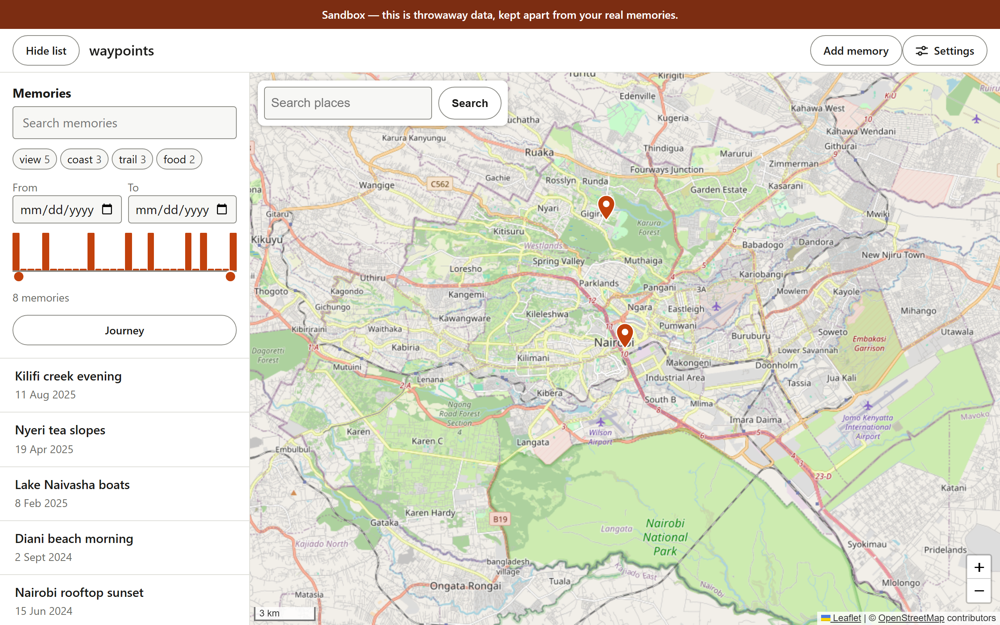
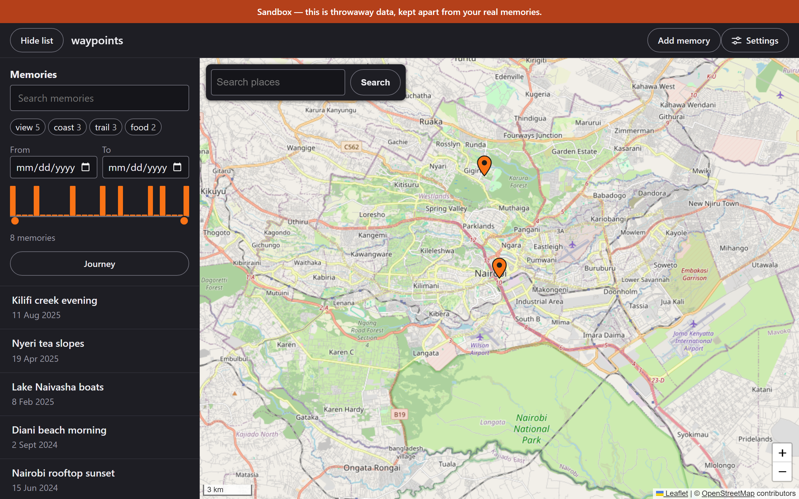
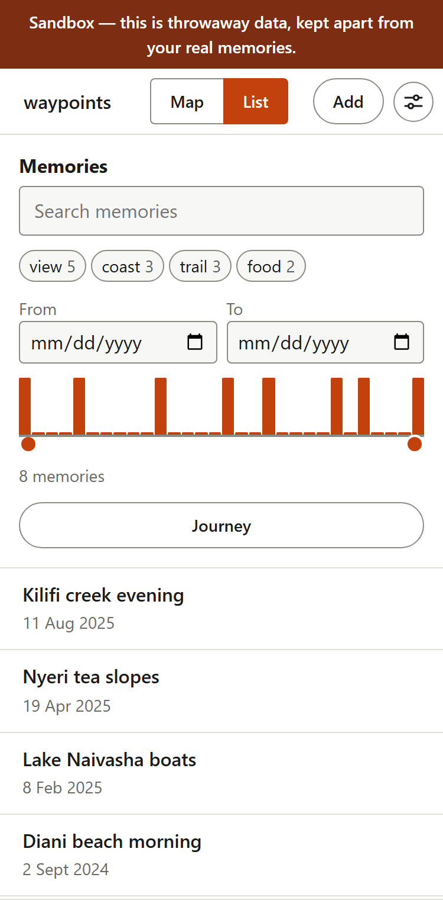

# waypoints

Pin your memories on a map: a place, a date, a note, a few photos. Everything stays in your
browser on your own device. There is no account, no server of ours, and nothing to sign up for.



<p align="center">
  
  
</p>

> The screenshots are taken in sandbox mode from invented data, which is why they carry the
> sandbox banner.

**The map is dimmed in dark mode rather than drawn dark.** No keyless provider offers a dark
raster basemap (the one that did now requires an API key), so the light tiles have their
colours turned over instead: water stays blue, parks stay green, and pins, photos and the
journey line are left alone. It is an approximation of a dark map, not a dark map, and
**Settings -> Dim the map in dark mode** turns it off.

---

## What it does

- **Pin a memory** anywhere on the map, with a title, a date, a note, tags and up to six photos.
- **Photos** are resized and re-encoded in the browser, with EXIF rotation applied, and stored
  on your device. They never leave it.
- **Find things again** by text, by tag, or by date range. Tags are a union: picking a second
  one widens the result. Every filter lives in the URL, so a filtered view can be bookmarked.
- **A timeline** under the filters shows when your memories happened, and doubles as a range
  slider.
- **Journey mode** joins the visible memories in date order, draws the route along great
  circles, and plays it back one stop at a time.
- **Place search** finds somewhere by name and offers to put a memory there.
- **Export and import** a single JSON file, with or without the photos inside it.
- **Works offline** once it has been loaded: a service worker caches the app and the map tiles
  you have already seen.
- **Installable** as an app on Chromium-based browsers and from Safari's share sheet.
- **Light and dark**, following your system or set explicitly, plus a forced-colours mode.
- **Keyboard and screen reader** throughout: markers are real buttons with real names, every
  dialog traps focus, and axe-core runs over the main states in the end-to-end suite.

## Running it

No build step. The browser loads the source files exactly as they are written.

```bash
npm install          # dev tooling only; the app itself has no dependencies
npm run dev          # http://localhost:5173
```

Two flags are useful while working on it:

| URL | What it does |
| --- | --- |
| `?sandbox` | Points every store somewhere else, so seeded data can never land on your real memories. Adds `seed(n)` and `clearSandbox()` to the console on a development host. |
| `?sw` | Registers the service worker, which is off by default on a development host so a cached page cannot answer while you are editing one. Loading without the flag unregisters it again. |

```bash
npm test             # unit tests, node --test, no browser
npm run test:e2e     # Playwright, Chromium and WebKit
npm run serve:prod   # the app behind the real production headers, on :5174
npm run precache     # regenerate the service worker's file list after changing a shipped file
```

`npm run test:e2e` starts `serve:prod` itself, so every end-to-end test runs under the same
Content-Security-Policy and cache headers as the deployment.

There are 850 unit tests and 82 end-to-end tests across the two engines.

## Your data

**Everything lives in your browser, on this device.** There is no server of ours and no account.

- Memories are kept in `localStorage`; photos are kept in IndexedDB.
- **Clearing your browser's site data deletes your memories.** So does "clear cookies and site
  data" for this site, and so can a browser cleaning up storage for a site you rarely visit.
  **Export regularly**: Settings → Export memories writes one JSON file.
- Each site origin has its own storage. `localhost` and the deployed address are different
  origins, so memories made in one are not visible in the other. To move them, export from one
  and import into the other.
- Import never replaces your collection. An unknown memory is added, a known one is only
  replaced if the incoming copy is newer, and nothing is written until you have seen what the
  file would change.

## Privacy

The app has no analytics and no telemetry. It does talk to three other parties, and this is all
of them:

| What | When | What they see |
| --- | --- | --- |
| [Nominatim](https://nominatim.openstreetmap.org/) (OpenStreetMap) | You press Search in the place box | The text you searched for |
| Nominatim | You place a pin, if place name suggestions are on | The coordinates of that pin |
| [OpenStreetMap tiles](https://operations.osmfoundation.org/policies/tiles/) | Whenever the map draws | Which areas of the map you look at |
| [jsDelivr](https://www.jsdelivr.com/) | On load | That your browser fetched Leaflet |

Place name suggestions can be turned off in **Settings → Place names**. With them off, placing a
pin sends nothing: the check happens before the request is built, not after it returns.

Their policies: [OpenStreetMap privacy](https://wiki.osmfoundation.org/wiki/Privacy_Policy),
[Nominatim usage policy](https://operations.osmfoundation.org/policies/nominatim/),
[tile usage policy](https://operations.osmfoundation.org/policies/tiles/),
[jsDelivr privacy](https://www.jsdelivr.com/terms/privacy-policy-jsdelivr-net).

## How it is built

Vanilla HTML, CSS and JavaScript ES modules. No framework, no bundler, no runtime dependencies.
npm is used for the test runner, a static server and Playwright, and for nothing that ships.

**Why no build step.** The thing in `src/` is the thing the browser runs. There is no compiled
output to go stale, no source maps to chase, and what you read in a stack trace is a file you
can open. The cost is paid in HTTP requests, which a service worker and a long-lived cache
largely absorb.

Modules are grouped by feature:

| Folder | What is in it | Pure? |
| --- | --- | --- |
| `data/` | Schema, normalization, validation, storage, the memory store | Yes |
| `filters/` | Search matching and filter state | Yes |
| `journey/` | Chronological ordering, great-circle geometry, the playback machine | Yes |
| `geo/` | Nominatim client, request scheduler, place parsers | Yes |
| `io/` | The export format and the import parser | Yes, except `download.js` |
| `photos/` | Processing, the repository and its IndexedDB backend | The repository is |
| `dev/` | Sandbox mode and the seed generator | Yes |
| `map/` | Everything that touches Leaflet | No |
| `ui/` | Everything that touches the DOM | No |

`map/` and `ui/` never import each other. `main.js` is the only place they are wired together,
and the only module with side effects at the top level.

**Dependencies are injected, everywhere.** Stores take their `storage`, `now` and `makeId`; the
photo repository takes its backend; the playback machine takes `setTimeout` and `clearTimeout`;
the Nominatim client takes `fetch`. That is what lets the pure modules be tested under `node`
with no browser and no mocking framework: a fake clock is a function, and a fake database is
a `Map`.

More detail, including the reasoning behind particular decisions, is in
[CLAUDE.md](CLAUDE.md). The export file format is specified in
[docs/export-format.md](docs/export-format.md).

## Credits

- Map data © [OpenStreetMap](https://www.openstreetmap.org/copyright) contributors, available
  under the [Open Database License](https://opendatacommons.org/licenses/odbl/).
- Tiles from the [OpenStreetMap tile servers](https://operations.osmfoundation.org/policies/tiles/),
  used under their tile usage policy.
- Geocoding by [Nominatim](https://nominatim.org/), used under the
  [Nominatim usage policy](https://operations.osmfoundation.org/policies/nominatim/).
- [Leaflet](https://leafletjs.com/) by Volodymyr Agafonkin and contributors (BSD-2-Clause).
- [Leaflet.markercluster](https://github.com/Leaflet/Leaflet.markercluster) by Dave Leaver and
  contributors (MIT).

Attribution stays visible on the map because keeping it there is a condition of use, not
decoration.

## Licence

[MIT](LICENSE) © Edwin Lungatso
